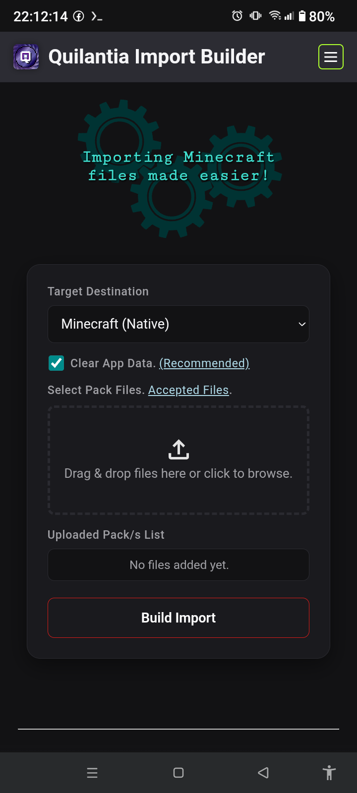
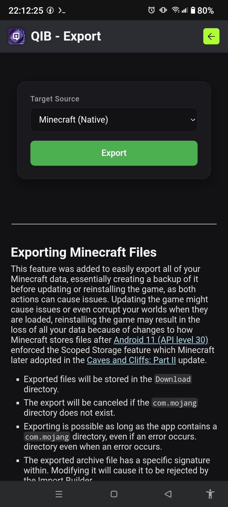

# Quilantia Import Builder

A local web app that assembles imports for **Minecraft Bedrock on Android** in a single instance.
> Call it Q Import Builder if having difficulties pronouncing /kɪˈlæn.ʃə/ (Quilantia).

 

Requirements:
- [Termux](https://github.com/termux/termux-app)
- [Termux:API](https://github.com/termux/termux-api)
- [Shizuku](https://play.google.com/store/apps/details?id=moe.shizuku.privileged.api)

> [!NOTE]
> The app is intended to be used mostly on devices with Android 11+ Operating System because of Shizuku's Wireless Debugging method. Feel free to configure your setup with Shizuku.

---

## Prerequisite

Using the Import Builder requires at least basic knowledge of how file managers and Minecraft Files work, and using a Terminal.

There is a guide section from the app to help users with Minecraft files and runtime problems because the app is not always consistent.

---

## Features

The app showcases both import and export to manage Minecraft data backups seamlessly:

* **Import Builder** - assembles uploaded Minecraft files into the `com.mojang` directory then transfers the build to Minecraft or Third-party apps that utilize Minecraft.
    * Accepts common [Minecraft Bedrock File Types](https://wiki.bedrock.dev/documentation/file-types).
    * Accepts ZIP archives (`.zip`), uses the `.mcpack`/`.mcaddon` reading function.
    * Accepts `options.txt` file to easily add preferred Minecraft settings.
    * Accepts `com.mojang.zip` archive that is generated by either import or export for importing an entire backup data easily.
    * (**Exclusive**) Accepts `.mcshots` archives, used for importing Minecraft screenshots with valid format. Note that Minecraft screenshots are account dependent when navigated in-game.
* **Exporting** - retrieves Minecraft data to essentially make backups of those. It can also retrieve data from Third-party apps as long as the app also has a `com.mojang` directory.

---

## Dependencies

The app relies heavily on NodeJS with other Node packages to run the app, and Shizuku's `rish` CLI to interact with special Android Debug Bridge privilege.

It also uses `coreutils` commands in the Terminal to run bash scripts, and other CLIs that may be used by users.

---

## Installation

The app's server will be run inside Termux, these steps are for initial installation only.

### Inside Termux

Run these commands to update packages and install git:

```bash
yes | pkg update
pkg install git -y
```

After package installation, clone this repository:

```bash
cd ~
git clone https://github.com/EditorOne-XI/do-my-mcpe-files.git
```

### Inside Shizuku

1. To setup `rish` CLI, setup Shizuku first.
2. After setting up Shizuku, go to **Use Shizuku in terminal apps**.
3. Click **Export files** (or follow steps for manual setup).
4. Navigate to **Sandwich/Menu Icon**.
5. Choose **Termux** in **Open from**.
6. Navigate to `do-my-mcpe-files/` directory.
7. Click **Use This Folder**.

After exporting the rish files, they should be with the cloned repository directory:
```
~/do-my-mcpe-files/
├── README.md
├── LICENSE
├── app/
├── src/
├── test/
├── checkbuild.sh
├── exportrun.sh
├── killapp.sh
├── package.json
├── rish              <-- Command
├── rish_shizuku.dex  <-- Binary
├── server.js
├── startapp.sh
└── transfer_build.sh
```
* The rish files are processed by `startapp.sh` automatically. If an error occurred, try setting it up manually.

### Inside Termux

To setup then start the app, run this script:

```bash
cd ~/do-my-mcpe-files
bash startapp.sh
```
* The options of the script are displayed after the setup.
* The command is used to run the app again.

---

## License

    Quilantia Import Builder - Assembles imports for Minecraft: Bedrock Edition
    Copyright (C) 2026  EditorOne XI

    This program is free software: you can redistribute it and/or modify
    it under the terms of the GNU General Public License as published by
    the Free Software Foundation, either version 3 of the License, or
    (at your option) any later version.

    This program is distributed in the hope that it will be useful,
    but WITHOUT ANY WARRANTY; without even the implied warranty of
    MERCHANTABILITY or FITNESS FOR A PARTICULAR PURPOSE.  See the
    GNU General Public License for more details.

    You should have received a copy of the GNU General Public License
    along with this program.  If not, see <https://www.gnu.org/licenses/>.

---

## Acknowledgments

- [Termux](https://github.com/termux/termux-app)
- [Shizuku](https://play.google.com/store/apps/details?id=moe.shizuku.privileged.api)
- [NodeJS](https://nodejs.org)
- [Express.js](https://expressjs.com)
- [AdmZip](https://www.npmjs.com/package/adm-zip)
- [Mojang/Microsoft](https://www.minecraft.net)

---

Project Started on 2026, June 3rd.
 
Thank You! <br> - EditorOne XI
